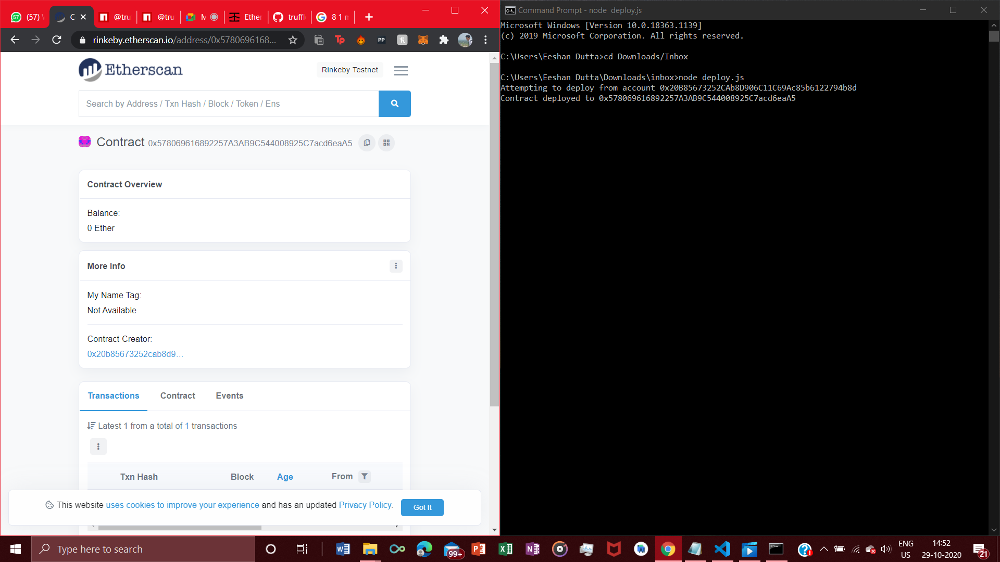

# Basic_DAPP_Structure

A basic Smart Contract is deployed in the the Rinkeby Ethereum Blockchain Testnet using the following modules and versions :-

 1) solidity - 0.7.4 (latest ver.)
 
 2) truffle/hdwallet-provider - 1.1.1
 
 3) ganache cli - 6.12.1
 
 4) web3 - 1.0.0-beta.26
 
 5) mocha - 8.2.0
 
 
